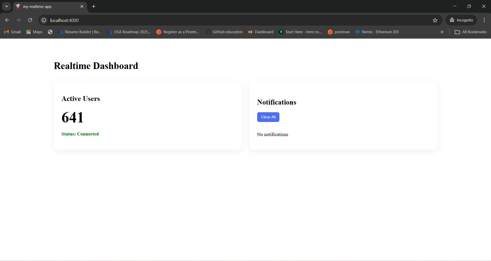
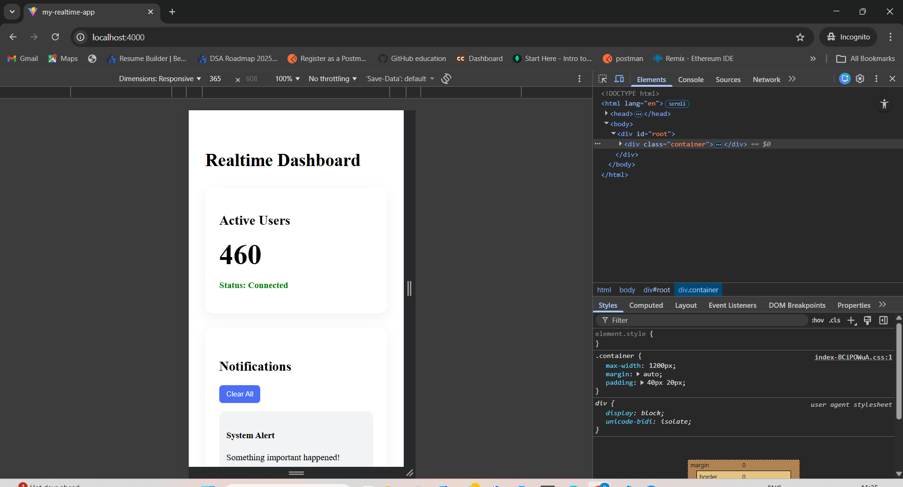
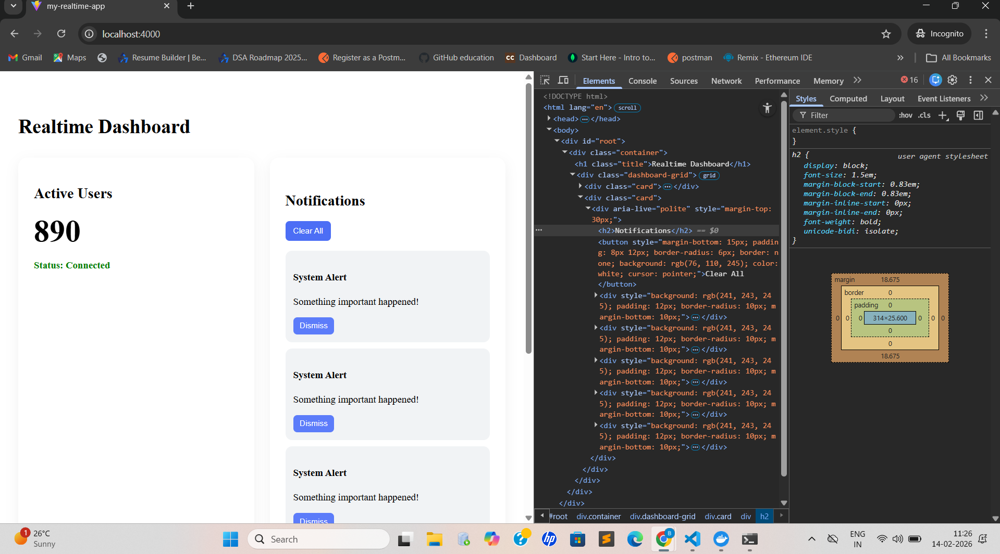

# 🚀 Realtime Dashboard

A modern realtime dashboard built with **React + WebSockets** that displays live user metrics and instant notifications.  
The application is fully containerized using **Docker** and designed with a responsive UI for mobile, tablet, and desktop devices.

---

## ✅ Assignment Requirements Covered

- ✔ Realtime updates using WebSockets  
- ✔ Notification system  
- ✔ Responsive UI (Mobile + Tablet + Desktop)  
- ✔ Error handling with Error Boundary  
- ✔ Environment-based configuration  
- ✔ Dockerized application  

---

## ✨ Features

✅ Live Active Users counter  
✅ Instant system notifications  
✅ Auto reconnect WebSocket  
✅ Clean card-based UI  
✅ Fully responsive layout  
✅ Docker support for easy deployment  

---

## 🛠 Tech Stack

**Frontend**
- React (Vite)
- Context API
- CSS

**Backend (Mock Server)**
- Node.js
- WebSocket (`ws`)

**DevOps**
- Docker
- Nginx (production build)

---

## 📸 Screenshots

### 💻 Desktop View


### 📱 Mobile View


### 📟 Tablet View


---


## 📁 Project Structure

```
my-realtime-app
│
├── mock-server
│     ├── package.json
│     └── server.js
│
├── screenshots
│     ├── desktopview.png
│     ├── mobileview.png
│     └── tabview.png
│
├── src
│   ├── components
│   │     ├── ErrorBoundary.jsx
│   │     ├── NotificationCenter.jsx
│   │     └── RealtimeMetric.jsx
│   │
│   ├── contexts
│   │     └── WebSocketContext.jsx
│   │
│   ├── services
│   │     └── websocket.js
│   │
│   ├── tests
│   │     ├── NotificationCenter.test.jsx
│   │     └── websocket.test.js
│   │
│   ├── App.jsx
│   ├── App.css
│   ├── index.css
│   └── main.jsx
│
├── .env.development
├── .env.production
├── Dockerfile
├── index.html
├── package.json
└── README.md
```

---


## ⚙️ Environment Variables

Create a `.env` file in the root:

```
VITE_WS_URL=ws://localhost:8080
```

For Docker / Production:

```
VITE_WS_URL=ws://host.docker.internal:8080
```

---

## ▶️ Run Locally

### 1️⃣ Start Mock WebSocket Server

```bash
cd mock-server
npm install
node server.js
```

Server runs at:

```
ws://localhost:8080
```

---

### 2️⃣ Start React App

```bash
npm install
npm run dev
```

App runs at:

```
http://localhost:5173
```

---

## 🐳 Run With Docker

### Step 1 — Build Image

```bash
docker build -t realtime-dashboard .
```

---

### Step 2 — Run Container

```bash
docker run -p 4000:80 realtime-dashboard
```

Open:

```
http://localhost:4000
```

⚠️ Make sure mock server is running before starting Docker.

---

## 🧪 Running Tests

```bash
npm test
```

---

## 👩‍💻 Author

**Sailaja**

Built as part of a realtime dashboard assignment to demonstrate WebSocket integration, responsive UI design, and Docker-based deployment.

---
